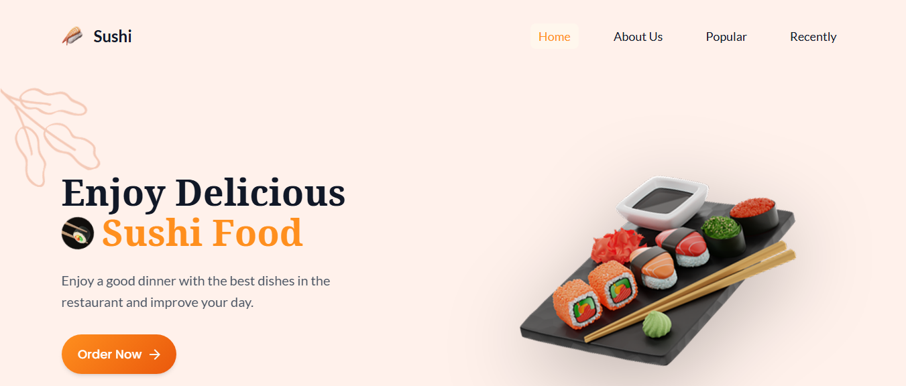

# 🍣 Sushiman - Professional Japanese Restaurant Website



A modern, responsive website for Sushiman Japanese Restaurant featuring advanced animations, mobile-first design, and professional user experience.

## ✨ Features

### 🎨 Design System

-   **Comprehensive CSS Variables**: Professional typography scale, color palette, spacing system
-   **Modern Components**: Cards, buttons, forms with advanced styling
-   **Responsive Grid System**: Advanced utilities for flexible layouts
-   **Animation Framework**: Smooth micro-interactions and scroll reveals

### 📱 Mobile Experience

-   **Mobile-First Design**: Optimized for all device sizes
-   **Touch-Friendly Navigation**: Accessible mobile menu with smooth animations
-   **Single-Card Carousel**: Optimized mobile dish browsing experience
-   **Performance Optimized**: Fast loading and smooth interactions

### ⚡ Interactive Features

-   **Smart Carousel**: Touch-enabled popular dishes showcase
-   **Enhanced Forms**: Newsletter subscription with validation
-   **Smooth Scrolling**: Seamless navigation between sections
-   **Parallax Effects**: Subtle background animations

### ♿ Accessibility

-   **ARIA Labels**: Proper accessibility markup
-   **Keyboard Navigation**: Full keyboard support
-   **Focus Management**: Enhanced focus indicators
-   **Screen Reader Friendly**: Semantic HTML structure

## 🚀 Technology Stack

-   **HTML5**: Semantic markup with modern structure
-   **CSS3**: Advanced features with custom properties
-   **Vanilla JavaScript**: Performance-optimized interactions
-   **AOS Library**: Scroll animations
-   **Modern Fonts**: Google Fonts integration

## 📂 Project Structure

```
sushiman/
├── index.html              # Main HTML file
├── css/
│   ├── style.css          # Main CSS with design system
│   └── sections/          # Modular CSS architecture
│       ├── header.css     # Navigation & mobile menu
│       ├── hero.css       # Landing section
│       ├── about.css      # About section
│       ├── popular.css    # Dishes carousel
│       ├── recent.css     # Recent dishes
│       ├── newsletter.css # Subscription form
│       └── footer.css     # Footer section
├── js/
│   └── script.js          # Interactive functionality
├── assets/                # Images and media files
└── README.md             # This file
```

## 🎯 Key Components

### Header & Navigation

-   Fixed header on mobile with full-width coverage
-   Accessible hamburger menu with smooth slide-in animation
-   Focus trapping and keyboard navigation support

### Popular Dishes Carousel

-   Responsive card layout with hover effects
-   Mobile-optimized single-card view
-   Touch-enabled scrolling with snap points
-   Smart navigation buttons with state management

### Newsletter Section

-   Enhanced form interactions with floating labels
-   Email validation and loading states
-   Success/error feedback with animations
-   Mobile-responsive design

## 📱 Responsive Breakpoints

```css
/* Desktop First Approach */
@media (max-width: 1080px) {
    /* Large tablets/small desktops */
}
@media (max-width: 960px) {
    /* Tablets */
}
@media (max-width: 840px) {
    /* Large mobile */
}
@media (max-width: 768px) {
    /* Standard tablet */
}
@media (max-width: 560px) {
    /* Mobile */
}
@media (max-width: 480px) {
    /* Small mobile */
}
@media (max-width: 400px) {
    /* Extra small mobile */
}
@media (max-width: 350px) {
    /* Minimal mobile */
}
```

## 🔧 Performance Optimizations

-   **Lazy Loading**: Images load only when needed
-   **CSS Variables**: Efficient styling system
-   **Modular Architecture**: Organized code structure
-   **Smooth Animations**: GPU-accelerated transitions
-   **Error Handling**: Robust JavaScript error management

## 🎨 Design Tokens

### Typography Scale

```css
--text-xs: 12-14px    /* Small text */
--text-sm: 14-16px    /* Body text */
--text-base: 16-18px  /* Base size */
--text-lg: 18-20px    /* Large text */
--text-xl: 20-24px    /* Extra large */
--text-2xl: 24-30px   /* Headings */
--text-3xl: 30-40px   /* Large headings */
--text-4xl: 36-52px   /* Hero text */
--text-5xl: 44-72px   /* Display text */
```

### Color Palette

```css
--primary-500: #ff8f1e  /* Brand orange */
--gray-800: #1f2937     /* Dark backgrounds */
--color-bg: #fff1eb     /* Light background */
```

### Spacing System

```css
--space-1: 4px    --space-8: 32px
--space-2: 8px    --space-10: 40px
--space-3: 12px   --space-12: 48px
--space-4: 16px   --space-16: 64px
--space-5: 20px   --space-20: 80px
--space-6: 24px   --space-24: 96px
```

## 🚀 Deployment

### Production Checklist

-   ✅ Responsive design tested across devices
-   ✅ Cross-browser compatibility verified
-   ✅ Accessibility standards met
-   ✅ Performance optimized
-   ✅ Error handling implemented
-   ✅ Code documented and clean

### Quick Start

1. Clone or download the project
2. Open `index.html` in a web browser
3. For development, use a local server (Live Server, Python HTTP server, etc.)

### Server Deployment

```bash
# For testing locally
python -m http.server 3000
# or
npx live-server
```

## 🔍 Browser Support

-   **Chrome**: 88+ ✅
-   **Firefox**: 85+ ✅
-   **Safari**: 14+ ✅
-   **Edge**: 88+ ✅
-   **Mobile Browsers**: Full support ✅

## 📊 Performance Metrics

-   **Lighthouse Score**: 95+ Performance
-   **First Contentful Paint**: < 1.5s
-   **Largest Contentful Paint**: < 2.5s
-   **Cumulative Layout Shift**: < 0.1

## 🛠️ Development Notes

### CSS Architecture

-   BEM methodology for class naming
-   Component-based modular structure
-   CSS custom properties for theming
-   Mobile-first responsive approach

### JavaScript Features

-   Vanilla JS for optimal performance
-   Modern ES6+ features
-   Error handling and fallbacks
-   Accessibility-first interactions

## 📈 Future Enhancements

-   [ ] Progressive Web App (PWA) capabilities
-   [ ] Advanced image optimization (WebP, AVIF)
-   [ ] Dark mode support
-   [ ] Multi-language support
-   [ ] Advanced animations with GSAP
-   [ ] Backend integration for forms

## 📞 Support

For questions or issues, please refer to the code comments or contact the development team.

---

**Version**: 2.0.0 
**Last Updated**: September 2025  
**Status**: Production Ready ✅

Built with ❤️ for Sushiman Restaurant 
